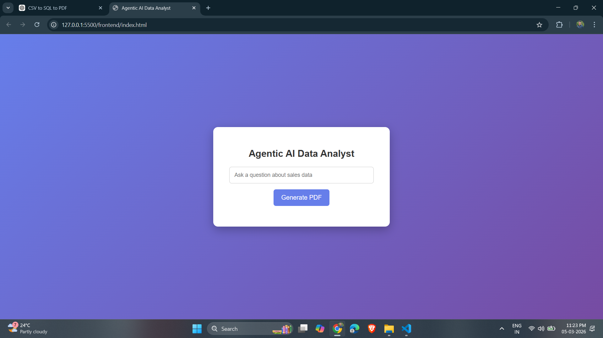
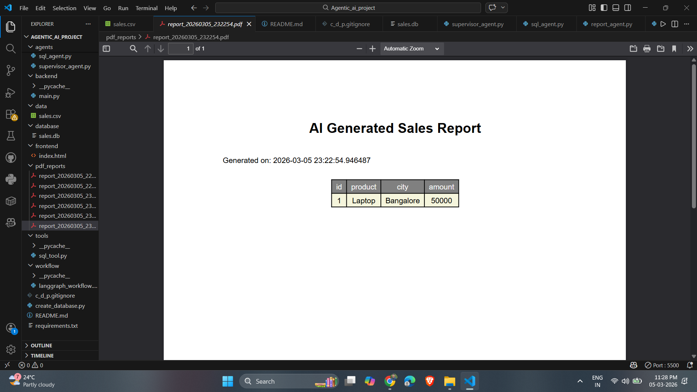

# 🤖 Agentic AI Data Analyst

An **Agentic AI system** that allows users to ask **natural language questions on CSV data** and automatically generate **SQL queries, retrieve results, and export professional PDF reports**.

The system uses **LangGraph agents**, **local LLM (Llama3 via Ollama)**, **FastAPI backend**, and a **modern dashboard frontend**.

---

# 🚀 Features

- 🧠 Natural Language → SQL Query Generation
- 🤖 Agentic AI Workflow using LangGraph
- 📊 CSV → SQLite Database Pipeline
- 📄 Automated PDF Report Generation
- 🌐 FastAPI Backend API
- 💬 Chat-style Dashboard UI
- 📜 Query History
- 🔍 SQL Query Preview
- 📊 Table Result Preview
- ⬇️ PDF Download Center
- 🖥️ Local LLM using Ollama (Llama3)

---

# 🏗️ System Architecture

User Question
↓
Frontend Dashboard
↓
FastAPI Backend
↓
LangGraph Workflow
↓
SQL Agent (LLM)
↓
SQLite Database
↓
Report Agent
↓
PDF Report Generation

---

# 🛠️ Tech Stack

| Technology      | Purpose                    |
| --------------- | -------------------------- |
| Python          | Core language              |
| FastAPI         | Backend API                |
| LangGraph       | Agent orchestration        |
| LangChain       | LLM integration            |
| Ollama          | Local LLM runtime          |
| Llama3          | Natural language reasoning |
| SQLite          | Database                   |
| Pandas          | Data processing            |
| ReportLab       | PDF generation             |
| HTML + CSS + JS | Frontend UI                |

---

# 📂 Project Structure

```
agentic_ai_data_analyst
│
├── data
│   └── sales.csv
│
├── database
│   └── sales.db
│
├── pdf_reports
│   └── (generated PDF reports)
│
├── agents
│   ├── supervisor_agent.py
│   ├── sql_agent.py
│   ├── report_agent.py
│
├── tools
│   └── sql_tool.py
│
├── workflow
│   └── langgraph_workflow.py
│
├── backend
│   └── main.py
│
├── frontend
│   └── index.html
│
├── create_database.py
├── requirements.txt
└── README.md
```

---

# ⚙️ Installation

### 1️⃣ Clone Repository

```
git clone https://github.com/yourusername/agentic-ai-data-analyst.git
cd agentic-ai-data-analyst
```

---

### 2️⃣ Create Virtual Environment

```
python -m venv .venv
```

Activate environment

Windows

```
.venv\Scripts\activate
```

---

### 3️⃣ Install Dependencies

```
pip install -r requirements.txt
```

---

### 4️⃣ Install Ollama

Download from

https://ollama.com

Pull the Llama model

```
ollama pull llama3
```

---

### 5️⃣ Create Database

Convert CSV to SQLite

```
python create_database.py
```

---

### 6️⃣ Run Backend

```
uvicorn backend.main:app --reload
```

Backend runs at

```
http://127.0.0.1:8000
```

---

### 7️⃣ Open Frontend

Open

```
frontend/index.html
```

in your browser.

---

# 💬 Example Queries

Try asking questions like:

```
Show all sales
```

```
Show Laptop sales in Bangalore
```

```
Show total sales by city
```

```
Which product has the highest sales
```

---

# 🖥️ UI Screenshots

## Dashboard UI



The dashboard provides a chat-style interface where users can ask questions about the dataset.  
It shows query history, generated SQL, results table, and allows downloading PDF reports.
## Generated PDF Report


Example:

- Chat interface for queries
- Query history sidebar
- SQL query preview
- Table results preview
- PDF download button

---

## Generated PDF Report

Add screenshot

```
docs/pdf_report.png
```

Report contains

- Report title
- Query used
- Data table
- Timestamp
- Professional formatting

---

# 📊 Example Workflow

User Question

```
Which product has the highest sales?
```

AI generates SQL

```
SELECT product, SUM(amount)
FROM sales
GROUP BY product
ORDER BY SUM(amount) DESC
LIMIT 1;
```

System executes SQL → generates PDF report.

---

# 🎯 Use Cases

- AI-powered data analysis
- Natural language database querying
- Automated reporting systems
- Business intelligence assistants
- AI data analyst tools

---

# 👨‍💻 Author

Prasad

Frontend Developer | AI Enthusiast

Skills

- React.js
- JavaScript
- LangChain
- LangGraph
- FastAPI
- Generative AI

---

# ⭐ Future Improvements

- Multi-dataset support
- Data visualization charts
- Dashboard analytics
- LangSmith monitoring
- Multi-agent orchestration
